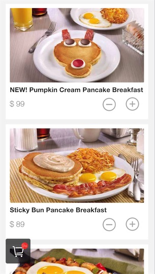

> spa boilerplate with vue2 & vuex & vue-router

> generate by webpack template: https://github.com/vuejs-templates/webpack

# Usage

`npm install`

`npm run dev`

then visit http://localhost:3000 you will get it.

# Production

 `npm run prod`
